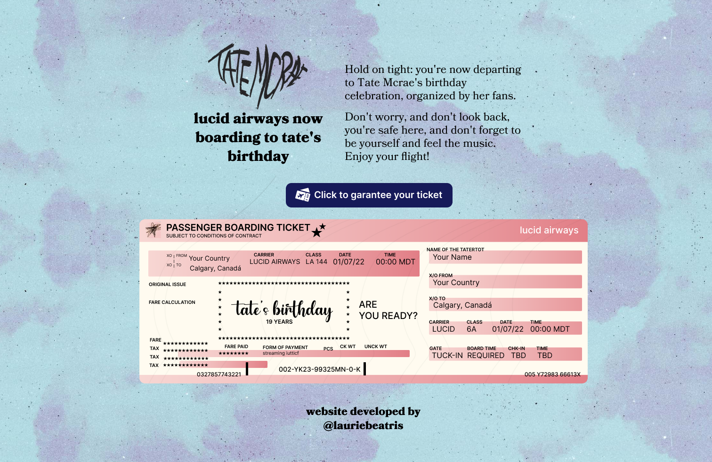

<h1 align='center'>Lucid Airways Ticket ✈️</h1>

<p align="center">
   
</p>

[](https://github.com/LauraBeatris)
[](#)
[](https://github.com/LauraBeatris/lucid-airways-ticket/stargazers)


<p align="center">
   <a href="https://lucidairwaysticket.com">Go check it out 🎉</a>
</p>

---

# :pushpin: Table of Contents

* [Running Locally](#construction_worker-running-locally)
* [FAQ](#postbox-faq)
* [Issues](#bug-issues)
* [Contributing](#tada-contributing)

## :construction_worker: Running Locally

```
$ git clone https://github.com/LauraBeatris/lucid-airways-ticket.git
$ cd lucid-airways-ticket
$ cp .env.local.example .env.local
$ cp .env.example .env
$ yarn
$ yarn dev
```

Define the environment variables by creating a .env.local file similar to [.env.local.example](https://github.com/LauraBeatris/lucid-airways-ticket/blob/master/.env.local.example)

# :postbox: Faq

**Question:** What are the technologies used in this project?

**Answer:** [Next.js](https://nextjs.org/), [Tailwind UI](https://tailwindui.com/), [Upstash](https://upstash.com/) and [Puppeteer](https://github.com/puppeteer/puppeteer).

**Question** Why Next.js instead of other frameworks of React out there?

**Answer** I chose Next.js in order to opt out for different rendering strategies. The tickets are generated by using Incremental Static Regeneration & API routes. 

# :bug: Issues

Feel free to **file a new issue** with a respective title and description. If you already found a solution to your problem, **I would love to review your pull request**!

